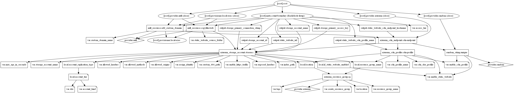

# Azure Static website with CDN Endpoint Terraform Module

Terraform Module to create an Azure storage account and enable the static website also creates optional CDN service for the static website.

To change the storage account kind, set the argument `account_kind` to the appropriate value. By default, account kind set to `StorageV2`.  If the storage account kind set to other types, this module automatically computes the appropriate values for `account_tier` and `account_replication_type` arguments. The valid options are `BlobStorage`, `BlockBlobStorage`, `FileStorage`, `Storage` and `StorageV2`.

> Note: *Static Website can only be created when the `account_kind` is set to `StorageV2`.*

These types of resources are supported

* [Storage Account](https://www.terraform.io/docs/providers/azurerm/r/storage_account.html)
* [Static Website](https://www.terraform.io/docs/providers/azurerm/r/storage_account.html#static_website)
* [Content Delivery Network (CDN)](https://www.terraform.io/docs/providers/azurerm/r/cdn_endpoint.html)
* [Custom domain with an Azure CDN endpoint](https://docs.microsoft.com/en-us/azure/cdn/cdn-map-content-to-custom-domain)

## Module Usage

```hcl
module "static-website-cdn" {
  source  = "kumarvna/static-website-cdn/azurerm"
  version = "2.2.0"

  # Resource Group, location, and Storage account details
  create_resource_group = true
  resource_group_name   = "rg-demo-westeurope-01"
  location              = "westeurope"
  storage_account_name  = "storageaccwesteupore01"

  # Static Website createion set to true by default
  # account_kind should set to StorageV2 or BlockBlobStorage
  static_website_source_folder = var.static_website_source_folder
  index_path                   = var.index_path
  custom_404_path              = var.custom_404_path

  # CDN endpoint for satic website
  enable_cdn_profile = true
  cdn_profile_name   = var.cdn_profile_name
  cdn_sku_profile    = var.cdn_sku_profile

  # Custom domain for CDN endpoint
  custom_domain_name = "web.example.com"
  friendly_name      = "mywebapp"
  
  # Adding TAG's to your Azure resources (Required)
  tags = {
    Terraform   = "true"
    Environment = "dev"
    Owner       = "test-user"
  }
}
```

## Create resource group

By default, this module will not create a resource group and the name of an existing resource group to be given in an argument `resource_group_name`. If you want to create a new resource group, set the argument `create_resource_group = true`.

## Static Website

Azure Storage can serve static content (HTML, CSS, JavaScript, and image files) directly from a storage container named $web. By default, this module enables the creation of a static website. To upload the static website content, set the folder path using argument `static_website_source_folder`.

## CDN Endpoint for Static Website

To add content delivery network acceleration to the static website, set the argument `enable_cdn_profile = true` and also provide appropriate values to the  `cdn_profile_name` and `cdn_sku_profile` arguments.

## Custom domain with an Azure CDN endpoint

Before you can use a custom domain with an Azure CDN endpoint, you must first create a canonical name (CNAME) record with your domain provider to point to your CDN endpoint. For Azure CDN, the source domain name is your custom domain name and the destination domain name is your CDN endpoint hostname. After Azure CDN verifies the CNAME record that you create, traffic addressed to the source custom domain (such as www.contoso.com) is routed to the specified destination CDN endpoint hostname (such as contoso.azureedge.net).

A custom domain and its subdomain can be associated with only a single endpoint at a time. However, you can use different subdomains from the same custom domain for different Azure service endpoints by using multiple CNAME records. You can also map a custom domain with different subdomains to the same CDN endpoint. This can be added using `custom_domain_name` argument with this module.

## Recommended naming and tagging conventions

Well-defined naming and metadata tagging conventions help to quickly locate and manage resources. These conventions also help associate cloud usage costs with business teams via chargeback and show back accounting mechanisms.

> ### Resource naming

An effective naming convention assembles resource names by using important resource information as parts of a resource's name. For example, using these [recommended naming conventions](https://docs.microsoft.com/en-us/azure/cloud-adoption-framework/ready/azure-best-practices/naming-and-tagging#example-names), a public IP resource for a production SharePoint workload is named like this: `pip-sharepoint-prod-westus-001`.

> ### Metadata tags

When applying metadata tags to the cloud resources, you can include information about those assets that couldn't be included in the resource name. You can use that information to perform more sophisticated filtering and reporting on resources. This information can be used by IT or business teams to find resources or generate reports about resource usage and billing.

The following list provides the recommended common tags that capture important context and information about resources. Use this list as a starting point to establish your tagging conventions.

Tag Name|Description|Key|Example Value|Required?
--------|-----------|---|-------------|---------|
Project Name|Name of the Project for the infra is created. This is mandatory to create a resource names.|ProjectName|{Project name}|Yes
Application Name|Name of the application, service, or workload the resource is associated with.|ApplicationName|{app name}|Yes
Approver|Name Person responsible for approving costs related to this resource.|Approver|{email}|Yes
Business Unit|Top-level division of your company that owns the subscription or workload the resource belongs to. In smaller organizations, this may represent a single corporate or shared top-level organizational element.|BusinessUnit|FINANCE, MARKETING,{Product Name},CORP,SHARED|Yes
Cost Center|Accounting cost center associated with this resource.|CostCenter|{number}|Yes
Disaster Recovery|Business criticality of this application, workload, or service.|DR|Mission Critical, Critical, Essential|Yes
Environment|Deployment environment of this application, workload, or service.|Env|Prod, Dev, QA, Stage, Test|Yes
Owner Name|Owner of the application, workload, or service.|Owner|{email}|Yes
Requester Name|User that requested the creation of this application.|Requestor| {email}|Yes
Service Class|Service Level Agreement level of this application, workload, or service.|ServiceClass|Dev, Bronze, Silver, Gold|Yes
Start Date of the project|Date when this application, workload, or service was first deployed.|StartDate|{date}|No
End Date of the Project|Date when this application, workload, or service is planned to be retired.|EndDate|{date}|No

> This module allows you to manage the above metadata tags directly or as a variable using `variables.tf`. All Azure resources which support tagging can be tagged by specifying key-values in argument `tags`. Tag `ResourceName` is added automatically to all resources.

```hcl
module "static-website-cdn" {
  source  = "kumarvna/static-website-cdn/azurerm"
  version = "2.2.0"

  # ... omitted

  tags = {
    ProjectName  = "demo-project"
    Env          = "dev"
    Owner        = "user@example.com"
    BusinessUnit = "CORP"
    ServiceClass = "Gold"
  }
}  
```
<!-- Do not Remove below, it allows for doc auto-updating -->
<!-- BEGINNING OF PRE-COMMIT-TERRAFORM DOCS HOOK -->
## Requirements

| Name | Version |
|------|---------|
| terraform | >= 0.13 |
| azurerm | >= 2.59.0 |

## Providers

| Name | Version |
|------|---------|
| azurerm | >= 2.59.0 |
| null | n/a |
| random | n/a |

## Inputs

| Name | Description | Type | Default | Required |
|------|-------------|------|---------|:--------:|
| access\_tier | The access tier of the storage account. | `string` | `"Hot"` | no |
| account\_kind | The kind of storage account. | `string` | `"StorageV2"` | no |
| allowed\_headers | A list of headers that are allowed to be a part of the cross-origin request. | `list(string)` | `["*"]` | no |
| allowed\_methods | A list of http headers that are allowed to be executed by the origin. Valid options are `DELETE`, `GET`, `HEAD`, `MERGE`, `POST`, `OPTIONS`, `PUT` or `PATCH`. | `list(string)` | <pre>[<br>  "GET",<br>  "HEAD"<br>]</pre> | no |
| allowed\_origins | A list of origin domains that will be allowed by CORS. | `list(string)` | <pre>[<br>  "*"<br>]</pre> | no |
| assign\_identity | Specifies the identity type of the Storage Account. At this time the only allowed value is SystemAssigned. | `bool` | `true` | no |
| cdn\_profile\_name | Specifies the name of the CDN Profile | `string` | `""` | no |
| cdn\_sku\_profile | The pricing related information of current CDN profile. Accepted values are 'Standard\_Akamai', 'Standard\_ChinaCdn', 'Standard\_Microsoft', 'Standard\_Verizon' or 'Premium\_Verizon'. | `string` | `"Standard_Akamai"` | no |
| create\_resource\_group | Whether to create resource group and use it for all networking resources | `bool` | `false` | no |
| custom\_404\_path | path from your repo root to your custom 404 page | `string` | `"404.html"` | no |
| custom\_domain\_name | The custom domain name to use for your website | `string` | `null` | no |
| friendly\_name | The friendly name of the custom domain in Azure Portal|`string` | `""` | no |
| enable\_cdn\_profile | Controls the creation of CDN profile and endpoint for static website. Possible values are `true` or `false` | `bool` | `false` | no |
| enable\_https\_traffic | Configure the storage account to accept requests from secure connections only. Possible values are `true` or `false` | `bool` | `true` | no |
| enable\_static\_website | Controls if static website to be enabled on the storage account. Possible values are `true` or `false` | `bool` | `true` | no |
| exposed\_headers | A list of response headers that are exposed to CORS clients. | `list(string)` | `["*"]` | no |
| friendly\_name | The friendly name of your custom domain in the Azure Portal | `string` | n/a | yes |
| index\_path | path from your repo root to index.html | `string` | `"index.html"` | no |
| location | The location of the resource group in which resources are created | `string` | `""` | no |
| max\_age\_in\_seconds | The number of seconds the client should cache a preflight response.  Defaults to 2 days | `number` | `172800` | no |
| resource\_group\_name | The name of the resource group in which resources are created | `string` | `""` | no |
| sku | The SKU of the storage account. | `string` | `"Standard_GRS"` | no |
| static\_website\_source\_folder | Set a source folder path to copy static website files to static website storage blob | `string` | `""` | no |
| storage\_account\_name | The name of the storage account to be created | `string` | `""` | no |
| tags | A map of tags to add to all resources | `map(string)` | `{}` | no |

## Outputs

| Name | Description |
|------|-------------|
| static\_website\_cdn\_endpoint\_hostname | CDN endpoint URL for Static website |
| static\_website\_cdn\_profile\_name | CDN profile name for the static website |
| static\_website\_url | static web site URL from storage account |
| storage\_account\_id | The ID of the storage account. |
| storage\_account\_name | The name of the storage account. |
| storage\_primary\_access\_key | The primary access key for the storage account. |
| storage\_primary\_connection\_string | The primary connection string for the storage account. |

<!-- END OF PRE-COMMIT-TERRAFORM DOCS HOOK -->

## Resource Graph



## Authors

Originally created by [Kumaraswamy Vithanala](mailto:kumarvna@gmail.com) and maintained with the help from [icornett](https://github.com/icornett)

## Other resources

* [Azure Storage documentation](https://docs.microsoft.com/en-us/azure/storage/)
* [Terraform AzureRM Provider Documentation](https://www.terraform.io/docs/providers/azurerm/index.html)
